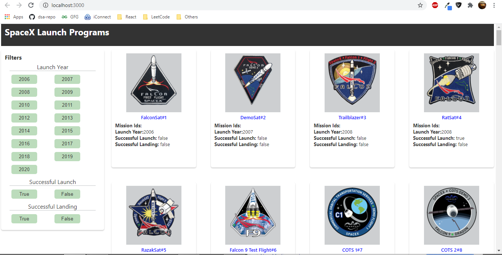

# Space-X Demo App

* This application is created using react. Redux is used for the state management and to handle the side effects in redux, redux-saga is used.
* Initially application launches with the data fetched using the url[https://api.spaceXdata.com/v3/launches?limit=100](https://api.spaceXdata.com/v3/launches?limit=100)
* Applying the filters will update the data and loads the page accordingly.\
Examples Urls for applying filters.

### Launch Success Filter: 

[https://api.spaceXdata.com/v3/launches?limit=100&launch_success=true](https://api.spaceXdata.com/v3/launches?limit=100&launch_success=true)

### Launch & Land Filter:

[https://api.spaceXdata.com/v3/launches?limit=100&launch_success=true&land_success=true](https://api.spaceXdata.com/v3/launches?limit=100&launch_success=true&land_success=true)

### All:

[https://api.spaceXdata.com/v3/launches?limit=100&launch_success=true&land_success=true&launch_year=2014](https://api.spaceXdata.com/v3/launches?limit=100&launch_success=true&land_success=true&launch_year=2014) 

## Below are the images of the application on different screens:

### Desktop View Of the Application(1024 and above):

### Tablet View Of the Application(1024 and below):

### Mobile View Of the Application(700px and below):

